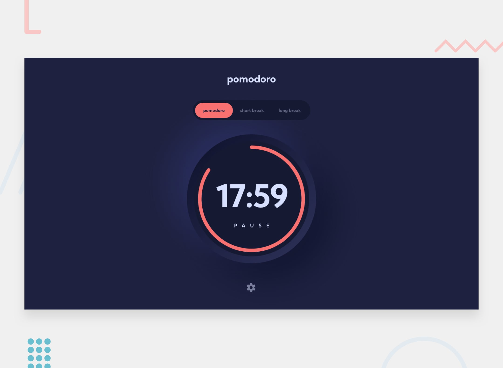

<h1 align="center"> Frontend Mentor - Pomodoro App</h1>

This is a solution to the [Pomodoro App challenge on Frontend Mentor](https://www.frontendmentor.io/challenges/pomodoro-app-KBFnycJ6G). Frontend Mentor challenges help you improve your coding skills by building realistic projects.

## Links

- [Solution](https://github.com/paladinescamila/Pomodoro-App)
- [Live Site](http://pomodoro-app-paladinescamila.netlify.app)

## Built with

- React.js
- TypeScript
- TailwindCSS
- Vitest
- Testing Library

## What I learned

-

## Continue development

-

## Author

- Website - [camilapaladines.netlify.app](https://camilapaladines.netlify.app)
- Frontend Mentor - [@paladinescamila](https://www.frontendmentor.io/profile/paladinescamila)
- LinkedIn - [@paladinescamila](https://co.linkedin.com/in/paladinescamila)
