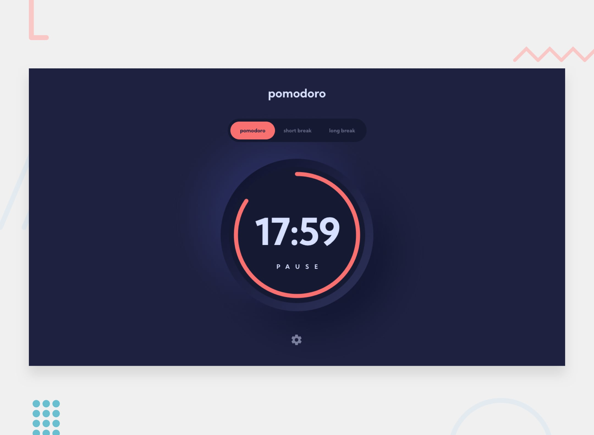

<h1 align="center"> Frontend Mentor - Pomodoro App</h1>

This is a solution to the [Pomodoro App challenge on Frontend Mentor](https://www.frontendmentor.io/challenges/pomodoro-app-KBFnycJ6G). Frontend Mentor challenges help you improve your coding skills by building realistic projects.

## Links

- [Solution](https://www.frontendmentor.io/solutions/pomodoro-app-qVk10kQeLf)
- [Live Site](http://pomodoro-app-paladinescamila.netlify.app)

## Built with

- React.js
- TypeScript
- TailwindCSS
- Vitest
- Testing Library

## What I learned

- I learned how to build a reusable countdown hook with start, pause, reset, and completion states.
- I practiced using TypeScript to model timer modes, settings, colors, fonts, and timer states safely.
- I learned how to persist user preferences with Zustand so the selected mode and settings remain available after refreshing the page.
- I improved accessibility with semantic controls, pressed states for mode selection, labels for form inputs, and keyboard-friendly settings dialog focus management.
- I practiced testing time-dependent behavior with Vitest fake timers and Testing Library, including countdown progress, pausing, reset behavior, and completion notifications.

## Continue development

- Add component and end-to-end tests for the timer controls, mode selection, settings form, and persisted preferences.
- Improve the timer flow by adding automatic transitions between pomodoro, short-break, and long-break sessions.
- Add a visible session counter or progress history to help users track completed focus sessions.
- Refine validation and feedback for custom durations, including clearer input error states.

## Author

- Website - [camilapaladines.netlify.app](https://camilapaladines.netlify.app)
- Frontend Mentor - [@paladinescamila](https://www.frontendmentor.io/profile/paladinescamila)
- LinkedIn - [@paladinescamila](https://co.linkedin.com/in/paladinescamila)
